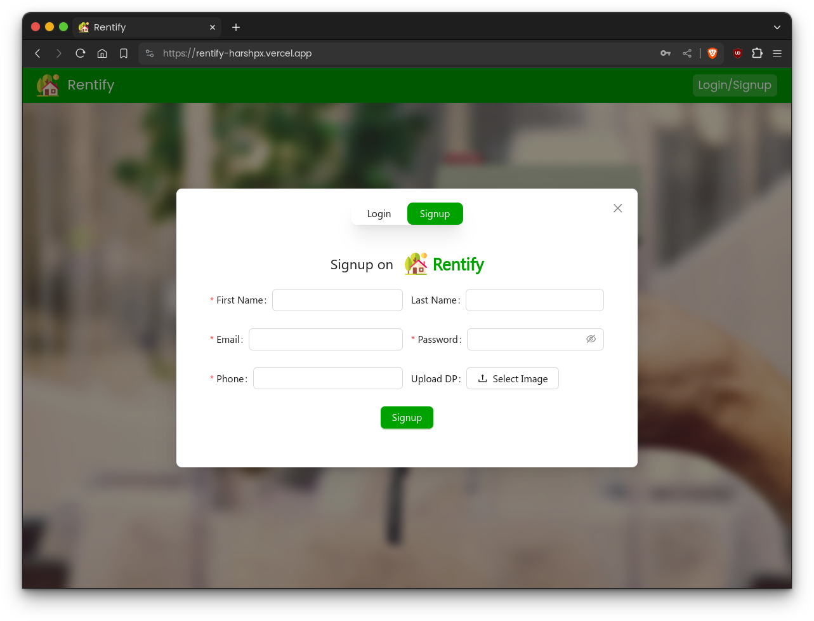

# HomeRentApp

HomeRentApp is a full-stack web application designed to simplify the process of finding and managing rental properties. Built with modern technologies, it offers a seamless experience for both tenants and landlords.

## Features

- **User Authentication**: Secure login and registration using JWT (JSON Web Tokens).
- **Property Listings**: Browse and search for available rental properties with filters.
- **Property Management**: Landlords can add, update, and remove property listings.
- **Image Upload**: Upload property images using **Cloudinary** and **Multer**.
- **Email Notifications**: Send emails using **Nodemailer** for booking confirmations and updates.
- **Responsive Design**: Built with **Tailwind CSS** for a modern and responsive UI.
- **State Management**: Managed using React's context API or Redux (if applicable).

## Technologies Used

### Frontend
- **React.js**: A JavaScript library for building user interfaces.
- **Tailwind CSS**: A utility-first CSS framework for styling.
- **Axios**: For making HTTP requests to the backend.

### Backend
- **Node.js**: A JavaScript runtime for building the backend.
- **Express.js**: A web framework for Node.js.
- **MongoDB**: A NoSQL database for storing application data.
- **Mongoose**: An ODM (Object Data Modeling) library for MongoDB.

### Additional Tools
- **JWT (JSON Web Tokens)**: For user authentication and authorization.
- **Multer**: For handling file uploads.
- **Cloudinary**: For storing and managing uploaded images.
- **Nodemailer**: For sending emails (e.g., booking confirmations).
- **Dotenv**: For managing environment variables.

## Getting Started

Follow these instructions to set up the project locally on your machine.

### Prerequisites

- **Node.js** (v16 or higher)
- **npm** (Node Package Manager)
- **MongoDB** (for database)
- **Cloudinary Account** (for image uploads)
- **Email Service** (e.g., Gmail for Nodemailer)

### Installation

1. **Clone the repository**:
   ```bash
   git clone https://github.com/Ramishworsah/HomeRentApp.git
   cd HomeRentApp


   
## Features
* Register/Login to our platform<br/>



