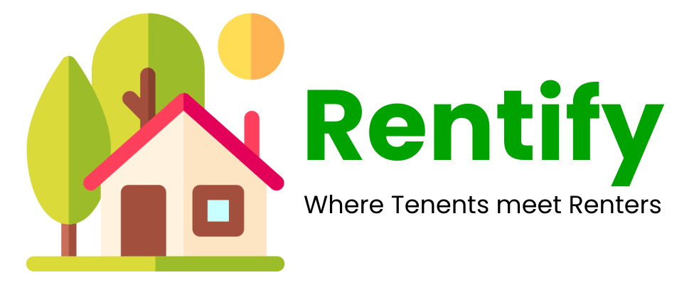

# HomeRentApp


### Rentify is a marketplace for people in search for houses for rent in major indian cities. It allows renters/property owners to list their properties on the page, and tenants can reach out to them using this platform.

## Tech Stack

#### Rentify is a Full-Stack Web Application developed with <ins>Mongo, Express, React, Node (MERN) Stack</ins>
<div style="font-size:20px">


</div>

#### Alongwith <ins>Tailwind CSS</ins> and <ins>Ant Design</ins> styling libraries
<div style="font-size:20px">


</div>

#### And Cloudinary & EmailJS for Image Storage and Mailing Service respectively
<div style="font-size:20px">


</div>
### Additional Tools
- **JWT (JSON Web Tokens)**: For user authentication and authorization.
- **Multer**: For handling file uploads.
- **Cloudinary**: For storing and managing uploaded images.
- **Nodemailer**: For sending emails (e.g., booking confirmations).
- **Dotenv**: For managing environment variables.

## Getting Started

Follow these instructions to set up the project locally on your machine.

### Prerequisites

- **Node.js** (v16 or higher)
- **npm** (Node Package Manager)
- **MongoDB** (for database)
- **Cloudinary Account** (for image uploads)
- **Email Service** (e.g., Gmail for Nodemailer)

### Installation

1. **Clone the repository**:
   ```bash
   git clone https://github.com/Ramishworsah/HomeRentApp.git
   cd HomeRentApp


   
## Features
* Register/Login to our platform<br/>


